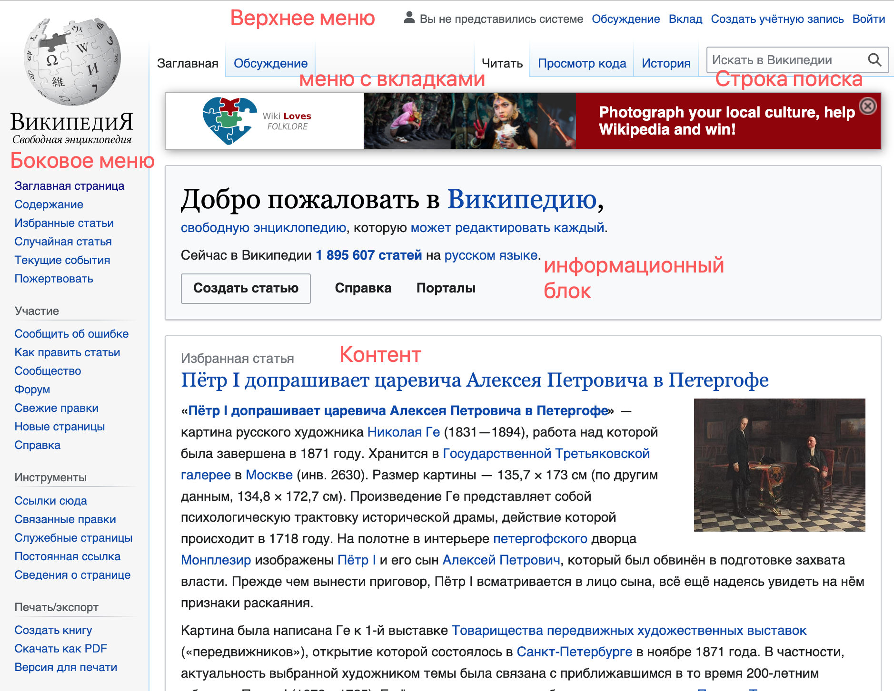
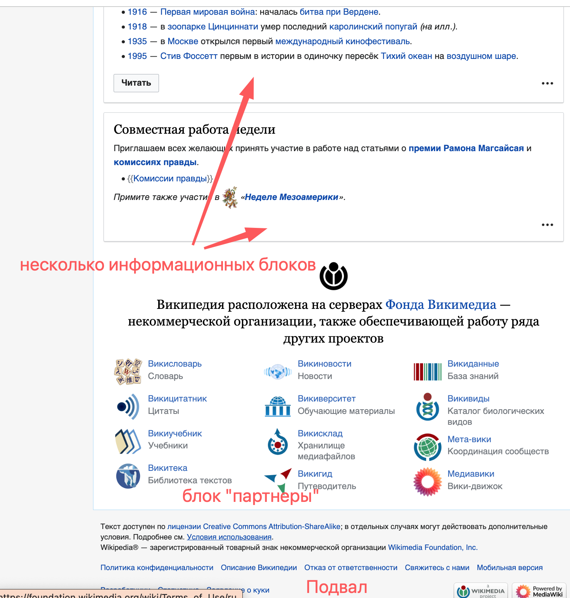

# Задание №2
Создайте файл 2_analyze.txt, в котором проанализируйте структуру страницы сайта https://ru.wikipedia.org/, а именно нужно описать (коротко, своими словами), какие блоки есть на сайте, что в этих блоках находится. Есть ли на сайте шапка, подвал, что в них содержится? Как и где расположен контент? Есть ли дополнительные элементы на странице?

## Анализ  (2_analyze.txt)

Структура страницы сайта https://ru.wikipedia.org/

* Шапка с меню, и аворизацией
* Боковое меню слева разбитое на несколько разделов
* Поле для поиска
* Вкладки для управления контентом и пр.
* Блок "добро пожаловать в википедию
* Далее идут несколько сгруппированных информационных блоков (контент)
    * Избранная статья
    * Хорошая статья
    * Избранные списки
    * Изображение дня
    * Новые материалы
    * События
    * События сегодня
    * Блок приглашение
* Блок с партнерами
* Подвал

На странице есть графические эелементы, кнопки, форма поиска

