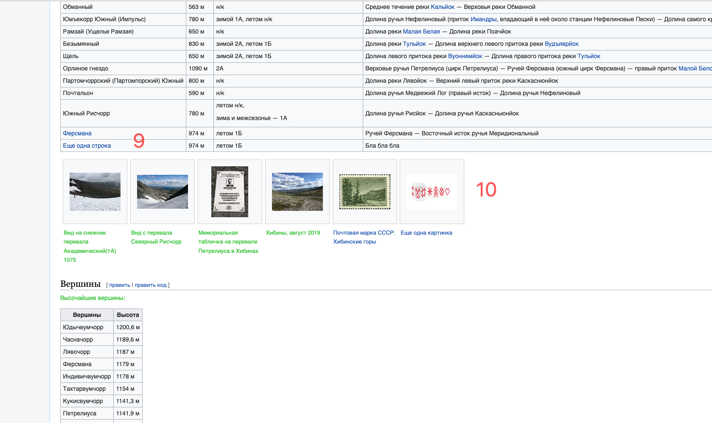

# Задание №3
Внесите не менее 10 изменений на страницу любой статьи сайта https://ru.wikipedia.org/, с помощью инструмента разработчика и представьте два скриншота было/стало (скриншоты должны иметь названия 3_before.jpg, 3_after.jpg соответственно). Желательно поработать с изменением текста на странице, заменой картинки, изменением стилей.

## BEFORE

## AFTER

