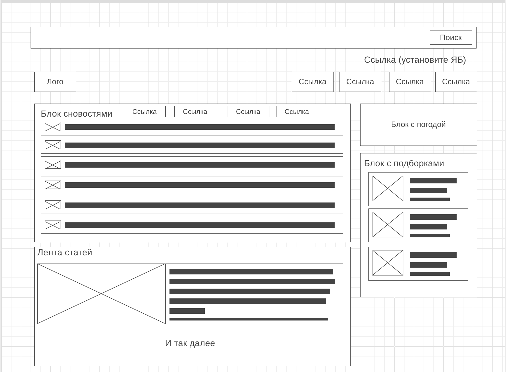

# Задание №4
Создайте прототип низкой детализации сайта https://dzen.ru/ с помощью сайта https://wireframe.cc/. Предоставьте скриншот того, что получилось (скриншот должен быть назван 4_proto.jpg).

